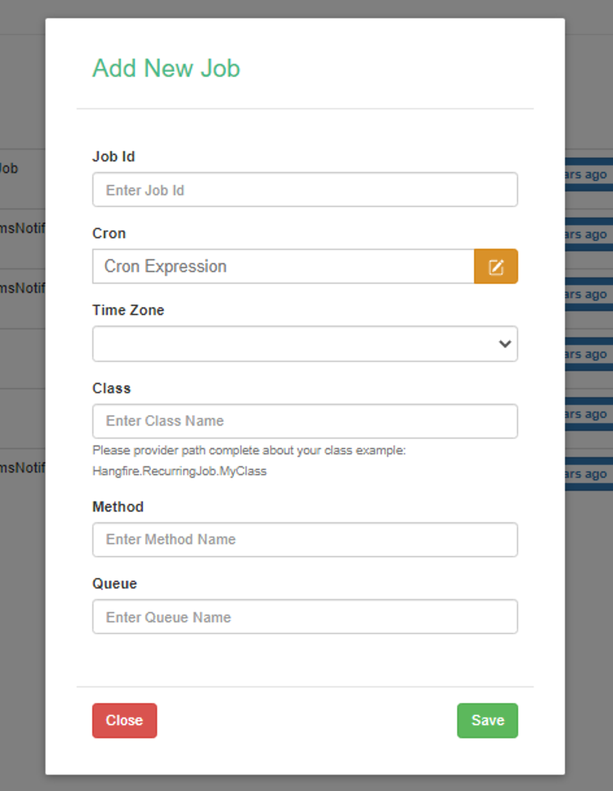
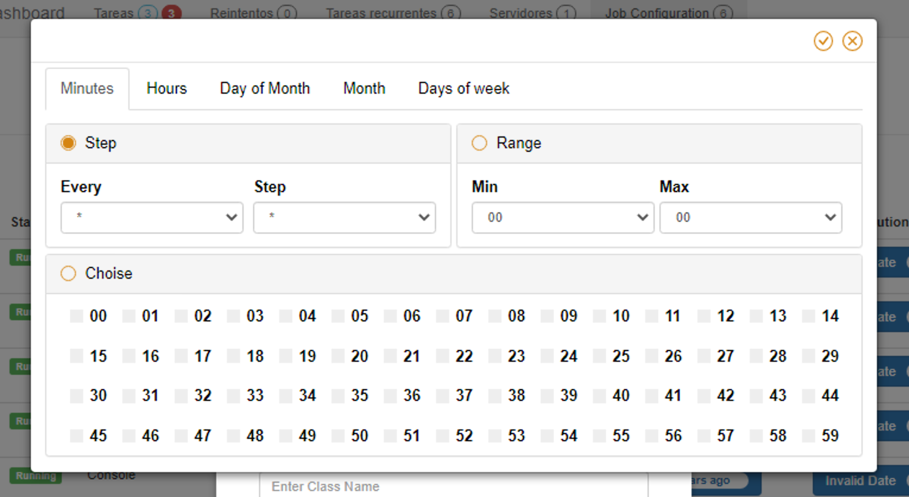

# Hangfire.RecurringJobAdmin
[](https://www.nuget.org/packages/Hangfire.RecurringJobAdmin/)
[](https://ci.appveyor.com/project/bamotav/hangfire-recurringjobadmin/branch/master)
[](https://github.com/bamotav/Hangfire.RecurringJobAdmin/actions)
[](http://hangfire.io)
[](http://opensource.org/licenses/MIT)


A simple dashboard to manage Hangfire's recurring jobs.

This repo is an extension for [Hangfire](https://github.com/HangfireIO/Hangfire) based on ["Hangfire.Recurring Job Extensions"](https://github.com/icsharp/Hangfire.RecurringJobExtensions/) package made by vigoss, thanks for your contribution to the community. It contains the following functionalities: 

* We can use RecurringJobAttribute stored in database and presented in the administrator.

```csharp
public class RecurringJobTesting
{
    [RecurringJob("*/2 * * * *", "China Standard Time", "default", RecurringJobId = "Check-File-Exists")]
    public void CheckFileExists()
    {
       Console.WriteLine("Check File Exists");
    }
}
```
* We can use DisableConcurrentlyJobExecution, this attribute allows you to not execute a task if it is already running.

```csharp
public class RecurringJobTesting
{
    [DisableConcurrentlyJobExecution("CheckFileExists")]
    public void CheckFileExists()
    {
       Console.WriteLine("Check File Exists");
    }
    
    [DisableConcurrentlyJobExecution("ValidateProcess", 0, 10, "It is not allowed to perform multiple same tasks.")]
    [RecurringJob("*/2 * * * *", "China Standard Time", "default", RecurringJobId = "Validate-Process")]
    public void ValidateProcess()
    {
        Console.WriteLine("Validate Process");
    }
}
```

* We can create, edit jobs.



* We can start, stop jobs at runtime.


* So we can also start or stop the job using JobAgent static class.

```csharp

   JobAgent.StopBackgroundJob("Enter the Job Id");
   
   JobAgent.StartBackgroundJob("Enter the Job Id");
   
   //Get all stopped jobs:
   var StoppedJobs = JobAgent.GetAllJobStopped();
   
```
* We have a new vue component to generate cron expression, made by [@JossyDevers](https://github.com/JossyDevers).




## Instructions
Install a package from Nuget. 
```
Install-Package Hangfire.RecurringJobAdmin
```

Then add this in your code:

## For DotNetCore  :
for service side:
```csharp
services.AddHangfire(config => config.UseSqlServerStorage(Configuration.GetConnectionString("HangfireConnection"))
                                                 .UseRecurringJobAdmin(typeof(Startup).Assembly))
```

## For NetFramework  :
for startup side:
```csharp
GlobalConfiguration.Configuration.UseSqlServerStorage("HangfireConnection").UseRecurringJobAdmin(typeof(Startup).Assembly)
```

## Credits
 * Braulio Alvarez
 
## Donation
If this project help you reduce time to develop, you can give me a cup of coffee :) 

[](https://www.paypal.com/cgi-bin/webscr?cmd=_donations&business=KTW8JH379NXQL&item_name=+&currency_code=USD&source=url)


## License
Authored by: Brayan Mota (bamotav)

This project is under MIT license. You can obtain the license copy [here](https://github.com/bamotav/Hangfire.RecurringJobAdmin/blob/master/LICENSE).

